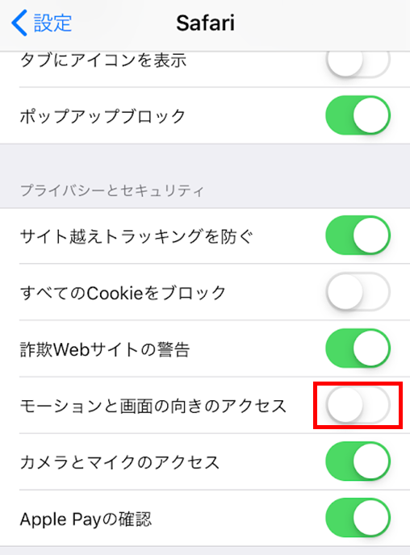
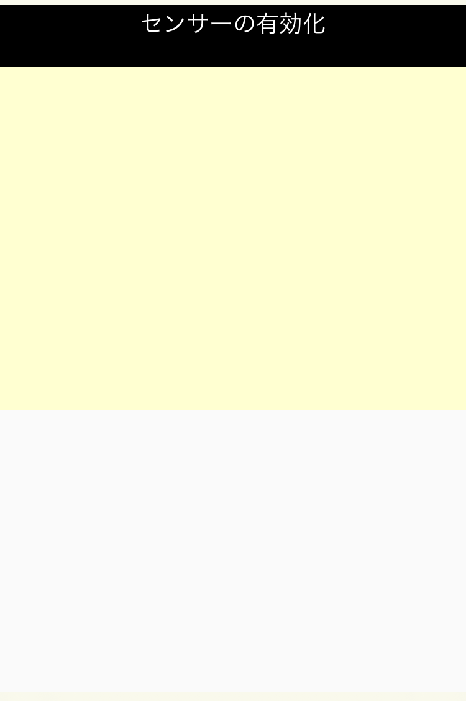
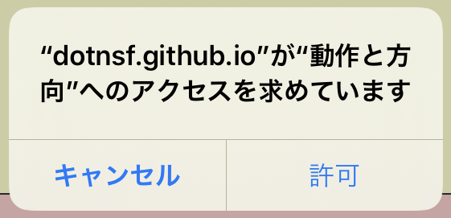
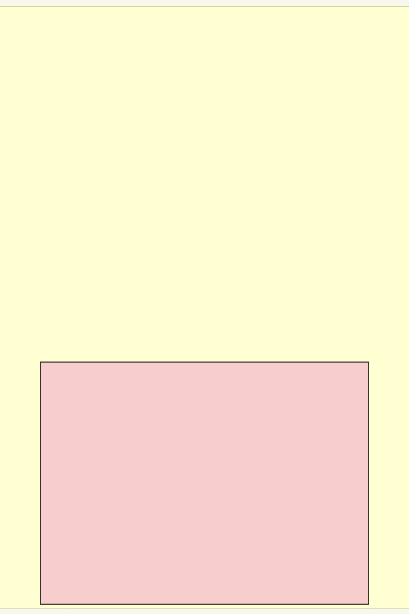
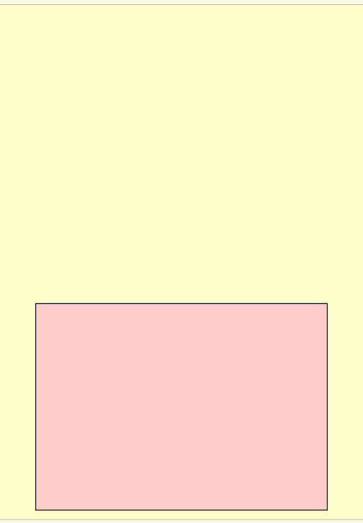
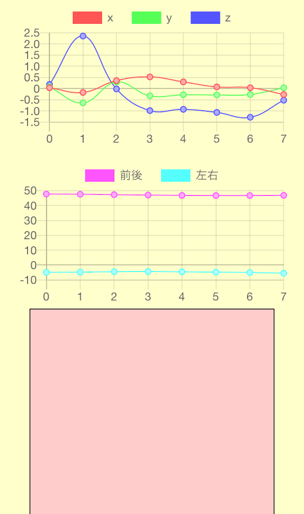
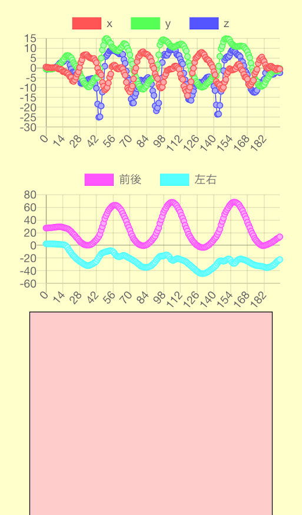
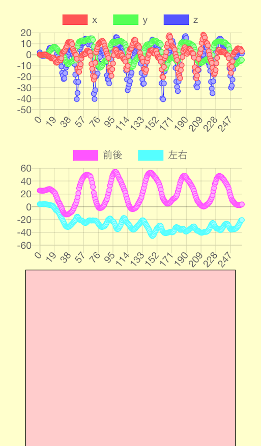
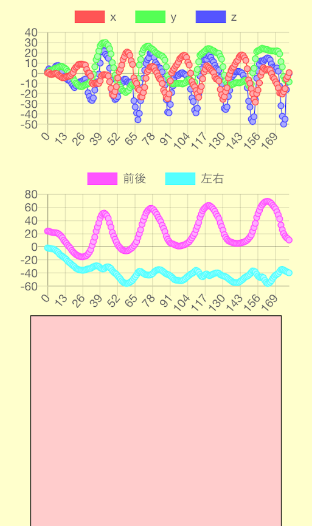
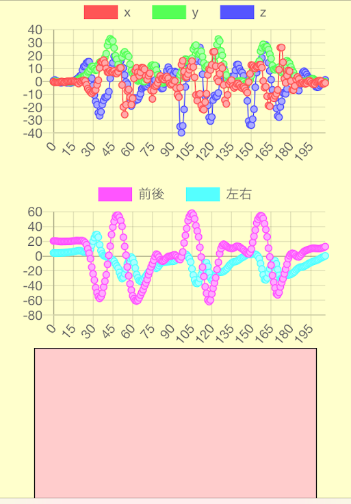

# MOS(Motion & Orientation Sensor)

## Overview

スマートフォンを簡易モーションセンサー＆オリエンテーションセンサー化して、センサーの数値をグラフ化するサンプルです。

## Requisites

ジャイロセンサーが搭載されたスマートフォンのウェブブラウザが必要です。 スマートフォンが Android の場合はほぼ問題なく大丈夫だと思っています。

iOS 搭載機を使って Safari ブラウザで利用する場合、iOS のバージョンによってはジャイロセンサー情報を取得するために以下の設定が事前・動作中に必要です：

- iOS 12.1 以下の場合、

  - 事前設定、動作中設定ともに不要です。そのまま動くはずです。

- iOS 12.2 以上 13 未満の場合、

  - 事前に **設定 - Safari の「モーションと画面の向きのアクセス」を ON** に設定しておいてください。以下の画面では OFF の状態です。

  - 

- iOS 13 以上の場合、

  - 事前設定は不要ですが、起動直後に **「センサーの有効化」** と書かれた画面上部のボタンをクリックする必要があります：

  - 

  - すると **「動作と方向へのアクセス」** への許可を求めるダイアログが表示されます。ここで **「許可」** を選択してください：

  - 

  - 「センサーの有効化」ボタンが消え、画面にピンクの矩形が表示されれば準備完了です：

  - 

## How to use

ジャイロセンサーが搭載されたスマートフォンのウェブブラウザで [index.html](./index.html) に [アクセス](https://dotnsf.github.io/mos/) します。画面下部にピンクの矩形が表示されていればセンシング準備が完了しています。

**ピンクの矩形部分をホールド（タップしたまま離さない）している間のみ、スマートフォンのジャイロセンサーの値を取得** します。矩形の **ホールドを解除する（タップを離す）と取得を終了** し、この間に取得したデータを画面上部に２つの折れ線グラフで表示します。試しに矩形部分を一瞬だけタップしてすぐに離した時の結果画面がこちらです：

ほんの一瞬のタップでも８回のデータ取得ができていることがわかります。センサー情報は非常に短い間隔で取得することができる、ということがわかります。

上部の折れ線グラフは３軸モーションセンサーから取得した **加速度** の値です。x, y, z（x: 左右, y: 上下, z: 前後）の３軸方向ごとに計測されたスマートフォンの移動加速度の値が折れ線グラフで表示されます。

下部の折れ線グラフはオリエンテーションセンサーから取得した **傾き** の値です（単位は度）。スマートフォンが前後方向および左右方向にどれだけ傾いていたかを計測し、その値の推移が折れ線グラフで表示されます。

## Samples

実際に動作を行った時の結果画面をサンプルとして提供します。１つ目は右手にスマートフォンを持って、その場で **「走るように手を振る」** （実際には走っていない、足は動かしていない）動作をした時の計測結果です：

下側のグラフの結果より、走るように手を振っていることでスマートフォン自体が前後／左右方向へ傾いていることがわかります。なおこの例では大きく３回手を前後させるように動かしています。

２つ目は同様に右手にスマートフォンを持って、**「その場で走りながら手をふる」** 動作をした時の計測結果です。その場で走る動作をしているため上下運動が加わり、腕の前後運動のグラフと y 軸方向（上下方向）の加速度のグラフが同じような動きになっていることがわかります：

３つ目は同様にして **「実際に走る」** 動作をした時の計測結果です。実際に走って横方向への移動が加わっているため、x 軸方向への加速度が大きくなっていることがわかります：

次の例は右手にスマートフォンを持って、 **「縄跳び」** を跳ぶ時のような動作をした時の計測結果です：

この例では３回縄跳びを跳んでいるつもりの動作を行っていますが、縄跳びを回す動作が前後／左右のスマホの傾きとして現れており、ジャンプして着地する動作が y 軸の加速度にあらわれている様子が確認できます。

## Reference

[端末画面の向きと端末のモーション](https://developers.google.com/web/fundamentals/native-hardware/device-orientation?hl=ja)

## Licensing

This code is licensed under MIT.

## Copyright

2020 [K.Kimura @ Juge.Me](https://github.com/dotnsf) all rights reserved.
